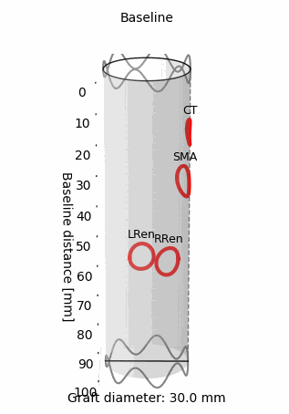

# 🩺 PUNCHplan – Fenestrated Stent Graft Planning Software

**PUNCHplan** is a lightweight, standalone surgical planning tool designed to assist vascular surgeons in planning **physician-modified endografts (PMEG)**.  
It enables precise design of fenestration locations, visual feedback in 2D/3D, and exports print-ready plans for intraoperative use.

---

## 🎥 Demo

<!--  -->

  
  

*Rotating 3D preview of a fenestrated stent graft generated with PUNCHplan.*

---

## 🚀 Features

- 🧭 Clock-position-based fenestration design
- 📏 Baseline distance input and dual referencing
- 🎯 Multiple fenestration types and diameters
- 🖼 2D and 3D visual preview (interactive)
- 📄 PDF export with surgical planning data
- 🧠 Ideal for FEVAR / PMEG preoperative workflows

---

## 📦 Download

> **➡️ [Download the latest version from the Releases tab](https://github.com/BenBalder/PUNCHplan/releases)**

No installation required. The program runs as a standalone `.exe`.

---

## 🖥 System Requirements

- Windows 10 or newer (64-bit)
- No installation necessary
- No internet connection required

---

## 📧 Feedback or Contact

If you have questions, feature requests, or feedback, feel free to contact me:

📬 **Bendegúz Juhos**  
`juhos.bendeguz@phd.semmelweis.hu`  
or [open an issue](https://github.com/BenBalder/PUNCHplan/issues)

---

## 📜 License
PUNCHplan - Software License Agreement

Copyright (c) 2025 Bendegúz Juhos

This software (PUNCHplan) is provided free of charge for academic and personal use only.

- Redistribution, modification, or commercial use of the software is strictly prohibited without prior written permission from the author.
- The software is distributed as a compiled executable (.exe) file only. No source code is provided.
- The software is provided "as is", without warranty of any kind, express or implied.

By using this software, you agree to the terms above.

---

© 2025 Bendegúz Juhos - Semmelweis Aortic Center, Department of Interventional Radiology, Heart and Vascular Centre, Semmelweis University, Budapest, Hungary

