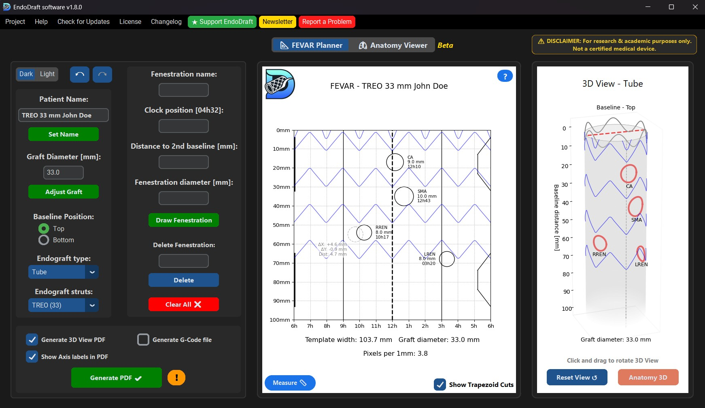
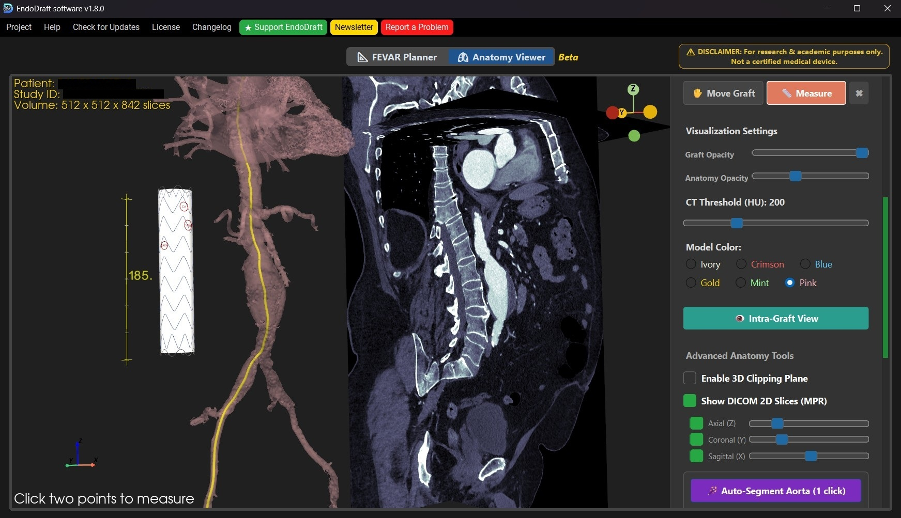
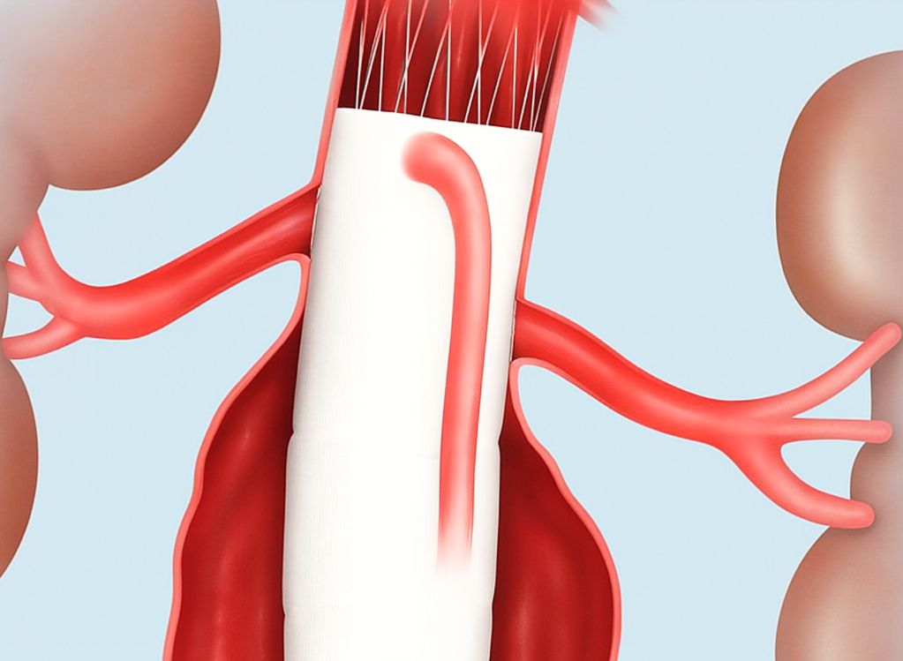
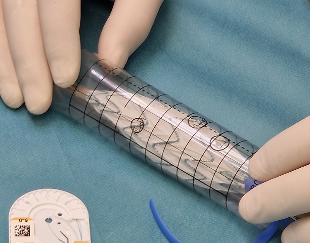

# EndoDraft® – Surgical Planning Software for Endovascular Interventions

🛠️ **EndoDraft** is a lightweight, standalone surgical planning software designed to assist interventional radiologists and vascular surgeons in planning **physician-modified endografts (PMEGs)**.  
It enables precise design of fenestration locations, visual feedback in 2D/3D, and exports print-ready plans for intraoperative use.

> **➡️ [Download](#-download)**

---

## 🎥 Demo

  

  

*Screenshots while using the software's 2D and 3D anatomy modules.*
  

  
  

*Sample graphics and photo about deploying a laser printed punch card made in EndoDraft.*

---

## 🚀 Powerful Features

A complete toolkit for the precise preoperative planning of Endovascular Interventions: EVAR, FEVAR, PMEG.

- 🩻 **Native DICOM Engine:** Load raw CT scans directly. Visualize anatomy with real-time Multi-Planar Reconstruction (MPR), Hounsfield thresholding, and dynamic clipping planes.
- 🪄 **1-Click Segmentation:** Advanced voxel-based morphology isolates the aorta, removes spine/bone artifacts, and generates highly accurate anatomical centerlines in seconds.
- 🎯 **3D FEVAR Planning:** Map target vessels directly on the 3D anatomy. EndoDraft automatically calculates tortuosity-aware arc lengths and precise clock-face projections.
- 🧲 **Smart Graft Fitting:** Snap and bend straight tubular endograft models seamlessly along the patient's anatomical centerline to verify fenestration alignment.
- 🗺️ **Interactive 2D Templates:** Drag-and-drop fenestrations on an unrolled graft map with real-time delta measurements and commercial strut collision visualization.
- 🖨️ **Surgical Export:** Generate print-ready PDF reports with precise axis scaling. Supports automated G-Code generation for sterile laser cutting.

---

## 📦 Download

> **➡️ [Download the latest version from the Releases tab](https://github.com/BenBalder/EndoDraft/releases)**

**⚠️ Windows SmartScreen & Antivirus Notice** 

Since the software does not yet have a digital signature (it costs a lot!), some operating systems (especially Windows) may display a **warning** when launching the .exe file, such as:
“Windows protected your PC” or “Unknown publisher”.

This is a standard behavior for unsigned applications and does not mean the file is dangerous. 
**EndoDraft** has been thoroughly tested and is **totally safe to use**, so you can ignore the warning.

**✅ If this happens, to proceed on Windows:**

- Click **“More info”**
- Then select **“Run anyway”**

For security reasons, installation is required with `EndoDraft_Setup_vX.X.X.exe`.

---

## 🖥 System Requirements

- Windows 10 or newer (64-bit)
- Permission to run EndoDraft Installer
- Internet connection for software updates
- The software is currently optimized for **Windows**, macOS or Linux users can have issues. **Development is in progress**.

---

## 📧 Feedback or Contact

If you have questions, feature requests, or feedback, feel free to contact me through the software:

> **➡️ [Download](#-download)** or [open an issue](https://github.com/BenBalder/EndoDraft/issues) (GitHub account required)

---

## 📜 License / Terms of Use

**EndoDraft - Software License Agreement** Copyright (c) 2026 Bendegúz Juhos

- **EndoDraft®** is provided free of charge for academic, educational and personal use only.
- Redistribution, modification, or commercial use of the software is strictly prohibited without prior written permission from the author.
- The software is distributed as a compiled executable (`.exe`), with installer/setup file. No source code is provided.
- The software collects anonymous usage statistics (e.g., graft type, number of fenestrations, OS version) to support development and research.
- NO PATIENT DATA, names, or identifiable personal information are transmitted. All data processing is strictly anonymous.
- The software is provided "as is", without warranty of any kind, express or implied.

> **⚠️ Legal Disclaimer / Medical Device Notice** > EndoDraft® is an **experimental research tool** provided exclusively for use by trained vascular specialists to support their own planning workflow. It is **not a certified medical device** (no CE mark, FDA approval, or equivalent) and does not provide medical advice, diagnosis, or treatment. It must not be relied upon as a standalone tool for direct clinical decision-making.  
>  
> The clinician remains **solely responsible** for all clinical decisions, medical procedures, and the use of any modified endografts.  
>  
> Use is entirely at your own risk and subject to the full [Terms of Use / Legal Notice](https://www.endodraft.com/legal_notice.html).

*By using this software, you agree to the terms above.*

---
© 2026 Bendegúz Juhos - Semmelweis Aortic Center, Department of Interventional Radiology, Heart and Vascular Centre, Semmelweis University, Budapest, Hungary
