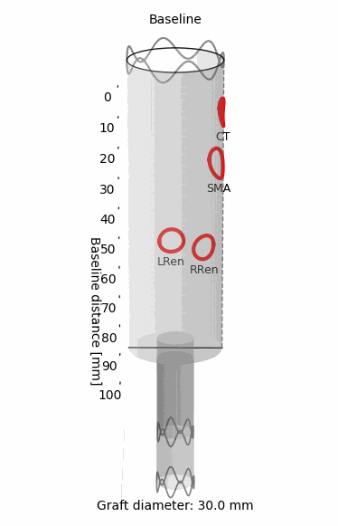

# EndoDraft® – Surgical Planning Software for Aneurysm Fenestration Templates

🛠️ **EndoDraft** (previously PUNCHplan) is a lightweight, standalone surgical planning software designed to assist interventional radiologists and vascular surgeons in planning **physician-modified endografts (PMEGs)**.  
It enables precise design of fenestration locations, visual feedback in 2D/3D, and exports print-ready plans for intraoperative use.
> **➡️ [Download](#-download)**
---

## 🎥 Demo

<!--  -->

  
  
  

*Sample 2D and rotating 3D preview of a fenestrated stent graft designed with EndoDraft.*
  

  
  

*Sample graphics and photo about deploying a laser printed punch card made in EndoDraft.*

---

## 🚀 Features

- 🧭 Computed Tomography (CT) based fenestration design
- 📏 Baseline distance and clock position input with dual referencing
- 🎯 Multiple fenestration types and diameters
- 🖼 2D and 3D visual preview (interactive)
- 📄 PDF export with surgical planning data
- 🧠 Ideal for FEVAR / PMEG preoperative workflows

---

## 📦 Download

> **➡️ [Download the latest version from the Releases tab](https://github.com/BenBalder/EndoDraft/releases)**

**⚠️ Windows SmartScreen & Antivirus Notice** 

Since the software does not yet have a digital signature (it costs a lot!), some operating systems (especially Windows) may display a **warning** when launching the .exe file, such as:
“Windows protected your PC” or “Unknown publisher”.

This is a standard behavior for unsigned applications and does not mean the file is dangerous. 
**EndoDraft** has been thoroughly tested and is **totally safe to use**, so you can ignore the warning.

**✅ If this happens, to proceed on Windows:**

- Click **“More info”**
- Then select **“Run anyway”**

No installation required. The program runs as a standalone `.exe`.

---

## 🖥 System Requirements

- Windows 10 or newer (64-bit)
- No installation necessary
- No internet connection required (only for software updates)
- The software is currently optimized for **Windows**, macOS or Linux users can have issues. **Development is in progress**.

---

## 📧 Feedback or Contact

If you have questions, feature requests, or feedback, feel free to contact me through the software:

> **➡️ [Download](#-download)**  or [open an issue](https://github.com/BenBalder/EndoDraft/issues) (GitHub account required)

---

## 📜 License
EndoDraft - Software License Agreement

Copyright (c) 2025 Bendegúz Juhos

This software (EndoDraft) is provided free of charge for academic and personal use only.

- Redistribution, modification, or commercial use of the software is strictly prohibited without prior written permission from the author.
- The software is distributed as a compiled executable (.exe) file only. No source code is provided.
- The software is provided "as is", without warranty of any kind, express or implied.

By using this software, you agree to the terms above.

---

© 2025 Bendegúz Juhos - Semmelweis Aortic Center, Department of Interventional Radiology, Heart and Vascular Centre, Semmelweis University, Budapest, Hungary

